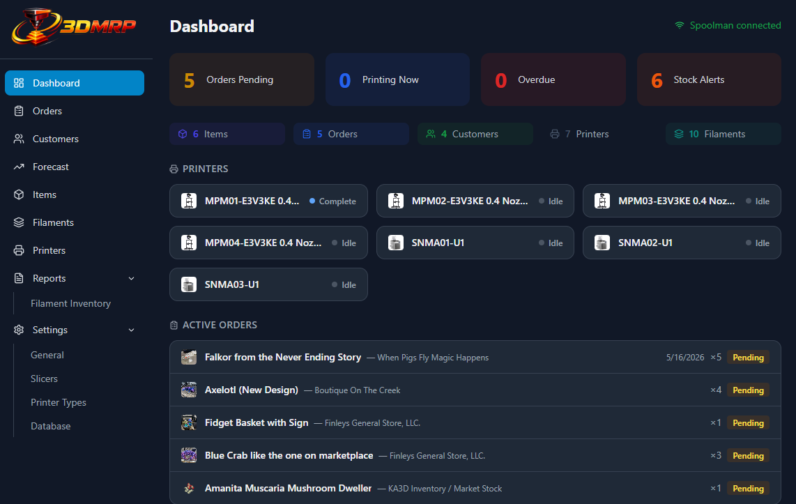
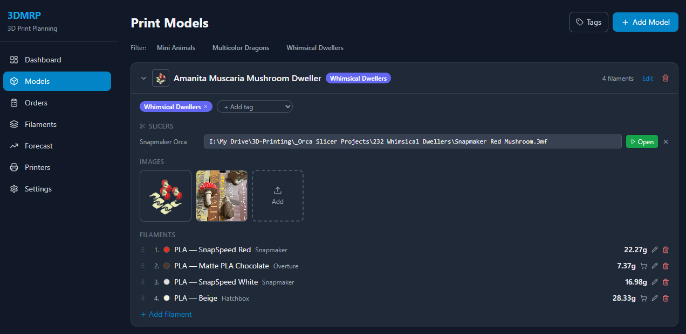
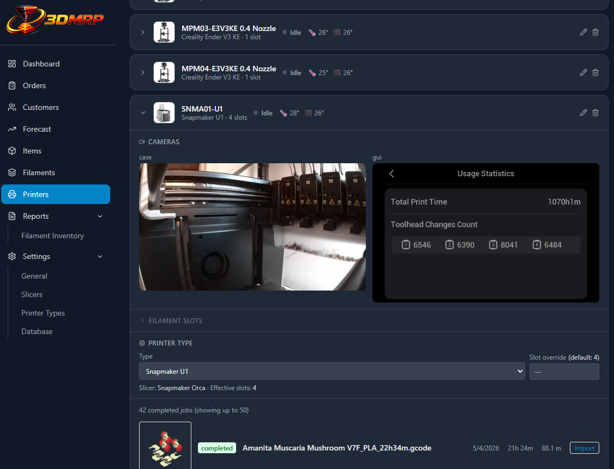
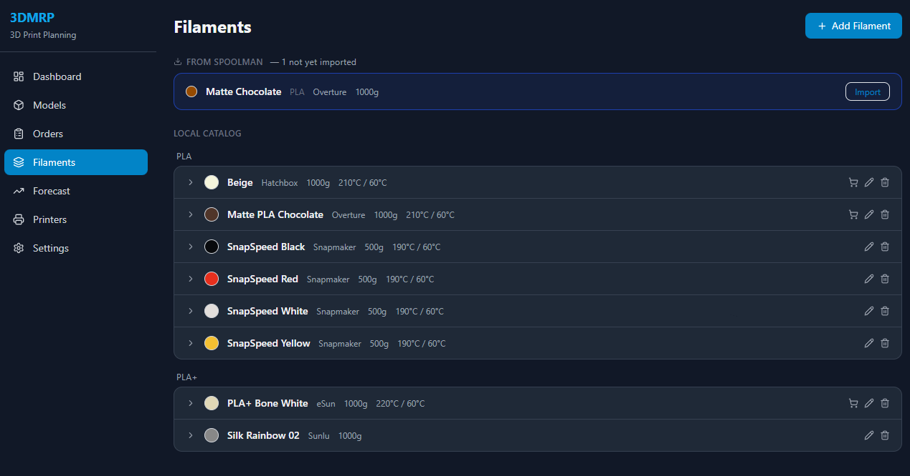

# 3DMRP — 3D Print Management & Resource Planning


A self-hosted web app for managing 3D print items, filament inventory, orders, and print queues. Built for multi-printer workshops that want a single place to track what gets printed, with what filament, and for whom.

## Screenshots

### Dashboard


### Items


### Printers


### Filaments


---

## Features

### Items
- Store items with name, SKU, description, notes, and multiple photos
- Upload photos or paste images directly from the clipboard
- Click any thumbnail to open a full-size lightbox with prev/next navigation, download, crop, and delete
- Define filament requirements per item (material, color, grams) with drag-and-drop slot ordering
- Tag items with color-coded categories and filter by tag
- Associate a slicer project file (`.3mf`) per printer and launch the slicer directly from the browser

#### Production Steps (Routing)
- Define multi-step production workflows per item (e.g. Print → Post-process → Assembly)
- Assign a printer type and quantity-on-plate to each step
- Each step carries its own filament requirements, auto-populated from the item's filament specs
- Switch between simple mode (single default routing) and advanced mode (multiple named routings)
- Rename routings inline; reorder and delete steps

### Filaments
- Manage a filament spec library with material, color, brand, temperature settings, and purchase URL
- Sync specs directly from a [Spoolman](https://github.com/Donkie/Spoolman) instance
- Live stock levels pulled from Spoolman for forecasting

### Printers
- Connect to [Klipper/Moonraker](https://moonraker.readthedocs.io) printers by URL
- Inline edit printer name and URL at any time
- Live status display: print state, progress bar, temperatures, and ETA
- Webcam feed via snapshot polling (works with Moonraker's camera API)
- Browse print job history and import jobs directly as item records
- Thumbnail preview shown during import
- Filament slot tracking with RFID auto-sync (reads `filament_detect` from Moonraker and matches to your filament library by material type and color)
- Assign a **Printer Type** to each printer and optionally override its slot count

### Printer Types
- Define reusable printer categories (e.g. "Bambu X1C", "Prusa MK4") with a default slot count
- Assign a slicer to each type so every printer of that type automatically uses the right software
- Manage types from **Settings → Printer Types**

### Slicers
- Maintain a library of slicer software entries, each with a name and executable path
- Link slicers to printer types for automatic slicer association
- Manage slicers from **Settings → Slicers**

### Customers
- Full CRM: store name, email, phone, address, notes, and category per customer
- Import customers from [Square](https://squareup.com) via the Square API, with sync to keep records up to date
- Link orders to customer records; order history visible per customer

### Orders
- Track print orders with customer, quantity, due date, and status (pending → printing → complete)
- Link each order to an item so filament requirements are always visible
- Create orders for items that don't exist yet — a placeholder item is auto-created and can be filled in later

### Dashboard
- Live overview: pending, printing, overdue, and stock alert counts
- Quick-nav cards showing live counts for Items, Orders, Customers, Printers, and Filaments
- Live printer status cards with progress and temperatures; click any card to jump to that printer
- Active orders sorted by urgency with due-date badges
- Filament stock alerts with one-click purchase links

### Forecast
- Demand forecast based on recent order history
- Shows projected filament consumption vs. Spoolman stock levels
- Flags filaments as OK / low / critical

### Reports
- **Filament Inventory** — live view of all active Spoolman spools grouped by material, with color swatches, remaining weight bars, and totals; auto-refreshes every 60 seconds

### Settings
Settings are organized into focused sub-pages accessible from a landing page:

- **General** — light/dark theme; Spoolman URL with live connection test; Square Personal Access Token; preferred Amazon store domain for purchase link auto-fill
- **Slicers** — add, edit, and remove slicer software entries
- **Printer Types** — define printer categories with default slot counts and slicer assignments
- **Database** — download a full database backup or restore from a previous backup file

### Navigation
- Collapsible tree navigation: **Settings** and **Reports** expand in the sidebar to show their sub-pages
- Auto-expands to the active section when navigating directly to a sub-page

## Stack

| Layer | Technology |
|---|---|
| Frontend | React 18, TypeScript, Vite, TailwindCSS, React Query |
| Backend | Python, FastAPI, SQLAlchemy, SQLite |
| Frontend serving | nginx in Docker |
| Backend | Native (Windows), started via `start.ps1` |

The frontend runs in Docker behind nginx. The backend runs natively on the host so it can launch local slicer applications (OrcaSlicer, PrusaSlicer, etc.) directly.

## Setup

### Prerequisites
- [Docker Desktop](https://www.docker.com/products/docker-desktop/) (for the frontend)
- [uv](https://github.com/astral-sh/uv) (Python package manager, for the backend)

### 1. Start the backend

```powershell
cd backend
.\start.ps1
```

This creates `backend/data/` for the SQLite database and uploaded images, then starts the API on `http://localhost:8000`.

### 2. Start the frontend

```powershell
docker compose up -d
```

The app is now available at `http://localhost:7891` (or set `PORT` in a `.env` file to use a different port).

### Environment variables

Copy `.env.example` to `.env` and adjust as needed:

```
PORT=7891
```

The backend reads `DATABASE_URL` and `DATA_DIR` from the environment — these are set automatically by `start.ps1`.

## Data

All data is stored in `backend/data/`:
- `3dmrp.db` — SQLite database
- `images/` — uploaded item and printer images

Use **Settings → Database** in the UI to download a backup or restore from one.

## Slicer integration

1. Go to **Settings → Slicers** and add your slicer software with its executable path (e.g. `C:\Program Files\OrcaSlicer\OrcaSlicer.exe`).
2. Go to **Settings → Printer Types**, create a printer type, and assign the slicer to it.
3. On the Printers page, assign each printer to its type.
4. On any item, set the path to its `.3mf` file for a given printer. An **Open** button will appear that launches the slicer with the file pre-loaded.

## Spoolman integration

Set the Spoolman URL in **Settings → General** (e.g. `http://192.168.1.100:7912`). Once connected:
- Filament specs can be imported from Spoolman
- Live spool weights are used in the forecast to calculate shortfalls
- The **Reports → Filament Inventory** page shows a real-time view of all active spools
