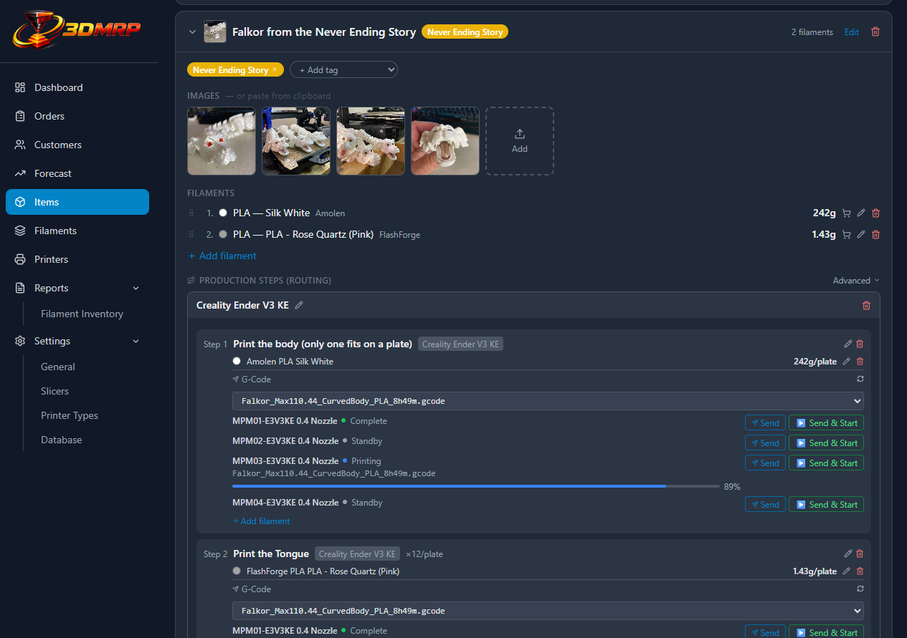
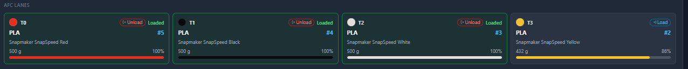
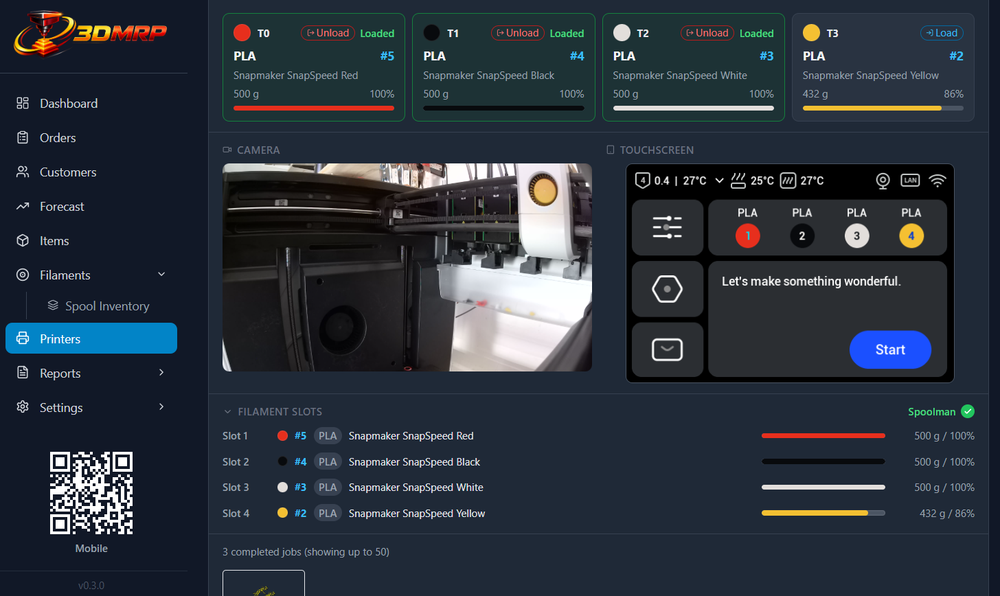
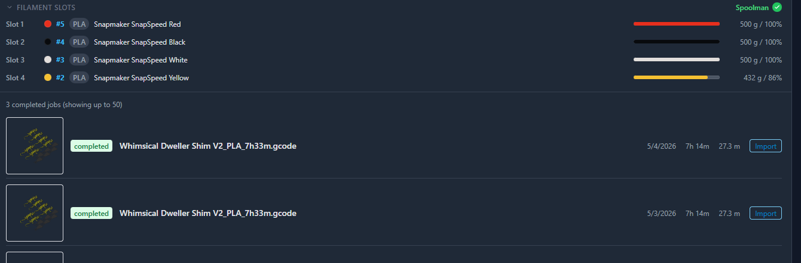
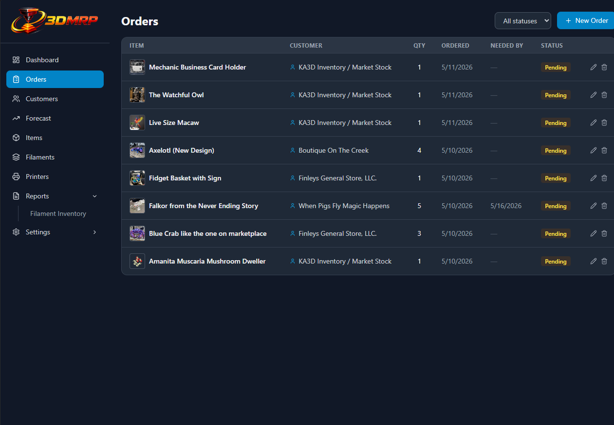
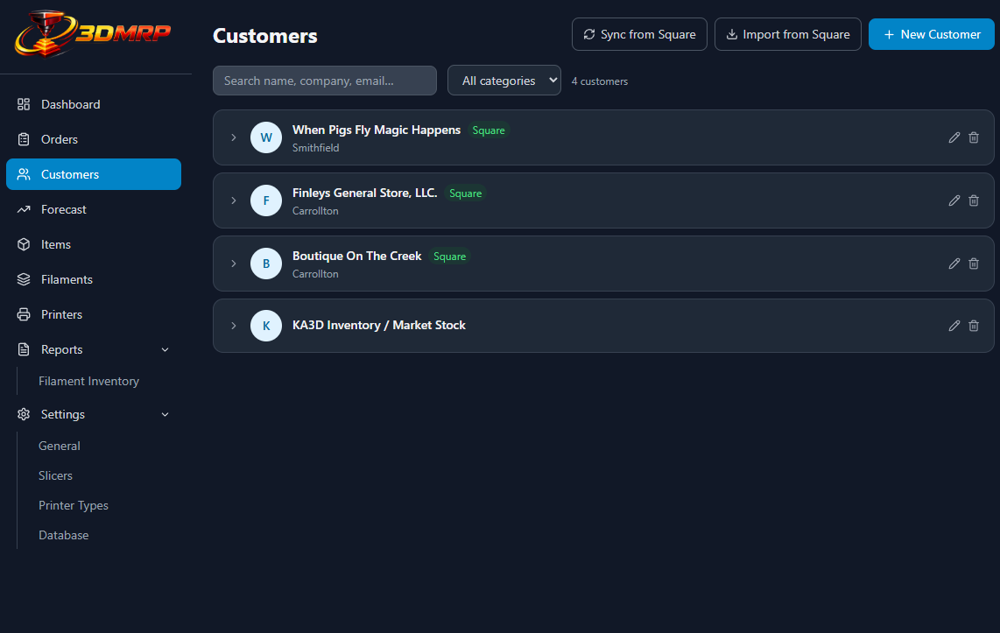
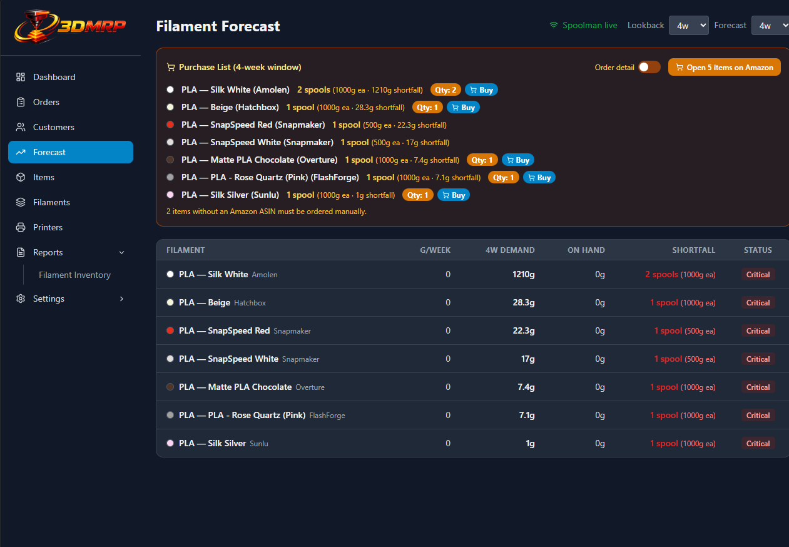
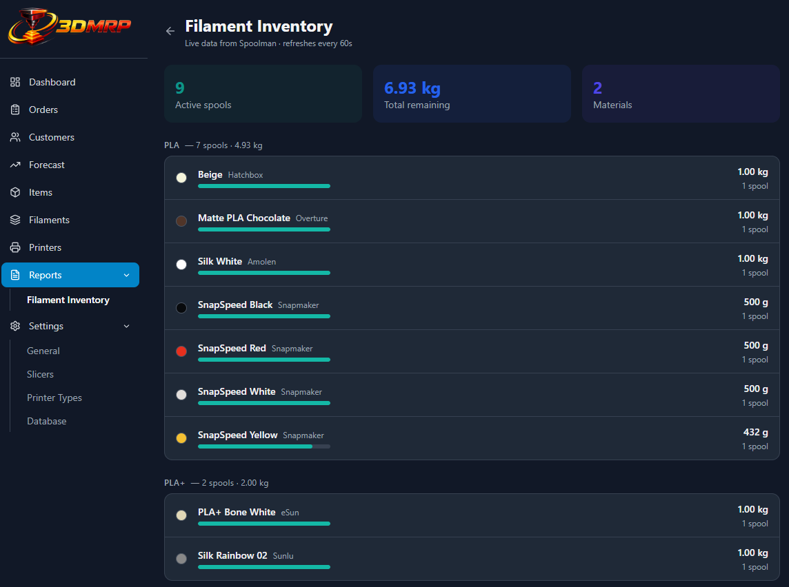
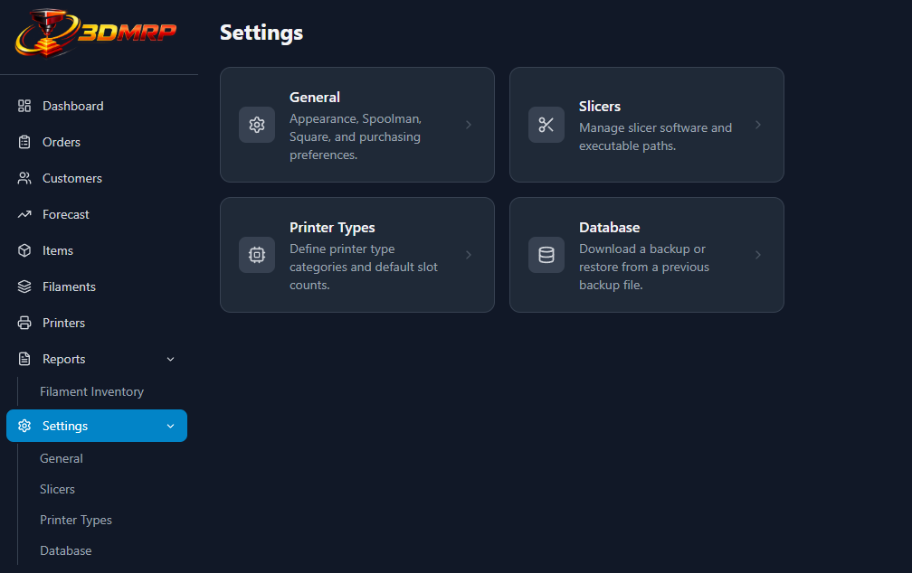

# 3DMRP — 3D Print Management & Resource Planning


A self-hosted web app for managing 3D print items, filament inventory, orders, and print queues. Built for multi-printer workshops that want a single place to track what gets printed, with what filament, and for whom.

[](https://buymeacoffee.com/mkloberg)

> **v0.4.8:** Live two-way spool location sync between 3DMRP and Spoolman — the foundation for RFID-based spool tracking across your printer fleet. Plus spool weighing workflow, inventory sort pills, and more.
>
> **v0.4.7:** Spoolman webhook support on the Spool Inventory page, unified NFC tagging via the persistent mobile session, TLS certificate persistence across container restarts, and several UX refinements.
>
> **v0.4.3:** Patch — fixes remaining null crashes on the Spool Inventory and Filament Inventory report pages when Spoolman filaments have a null name or material field.
>
> **v0.4.2:** QR Code Label Printer setting moved to General Settings, plus an additional null-safety fix in the Spoolman import form.
>
> **v0.4.1:** Patch — fixes a crash on the Filaments and Filament Inventory pages when Spoolman returns filaments with a null name or material field.
>
> **v0.4.0:** 3DMRP now has a mobile companion app. Scan a QR code once and your phone stays connected — permanently. Walk up to any spool, tag both sides with NFC, print a QR label directly to your label printer, and move on. No dialogs. No tapping "confirm" on a desktop. The spool workflow is now fully hands-free.
>
> **v0.3.1:** G-Code thumbnail previews with zoom & drag, native Windows file picker for model files, redesigned Analyze wizard step 1, and AFC load/unload reliability improvements.
>
> **v0.3.0:** 3DMRP started as a production planning tool — a place to manage items, orders, and filament. It has quietly grown into something more: a **fleet command and control center** for Klipper/Moonraker printer farms. You can now monitor every printer's live status, load and unload filament lanes remotely, mirror and interact with the printer touchscreen, and see aggregated fleet statistics across your entire operation — all from a single browser tab. The MRP roots are still here; the scope is now bigger.

---

## Features

### Dashboard

Live overview of your shop at a glance.

- Pending, printing, overdue, and stock alert counts
- Quick-nav cards with live counts for Items, Orders, Customers, Printers, and Filaments
- Live printer status cards with progress and temperatures — click any card to jump to that printer
- **Fleet Stats** — aggregated across all printers: total jobs, total print time, total filament used, longest print, and job outcome breakdown (completed / cancelled / errors)
- Active orders sorted by urgency with due-date badges
- Filament stock alerts with one-click purchase links


<!-- SCREENSHOT PLACEHOLDER: Full dashboard showing the Fleet Stats row beneath the printer cards. Make sure at least one printer is printing so the live status card shows a progress bar. -->

---

### Items

Store and manage your printable models.

- Name, SKU, description, notes, and multiple photos per item
- Upload photos or paste images directly from the clipboard
- Click any thumbnail to open a full-size lightbox with prev/next navigation, download, crop, and delete
- Define filament requirements (material, color, grams) with drag-and-drop slot ordering
- Tag items with color-coded categories and filter by tag
- **Model Files** — associate a model file (`.3mf`, `.stl`, or any format your slicer accepts) per printer type, and launch the slicer directly from the browser with the file pre-loaded. Click the **folder icon** to open a native Windows file browser filtered to `.3mf` / `.stl` — no typing required. The dialog remembers the last-used directory and opens at the existing file's location when editing
- **STL Source URL** — store a link to the original STL source (Printables, Thingiverse, etc.); clickable directly from the item list



#### Production Steps (Routing)

Define how an item gets made — step by step.

- Multi-step production workflows per item (e.g. Print → Post-process → Assembly)
- Assign a printer type and quantity-on-plate to each step
- Each step carries its own filament requirements, auto-populated from the item's filament specs
- Switch between simple mode (single default routing) and advanced mode (multiple named routings)
- Rename routings inline; reorder and delete steps
- **Cost accounting** — each step supports an MSRP and post-processing cost, giving a full cost breakdown per item
- **Spoolman status** — each printer shown in a production step displays a live Spoolman indicator (green check = active, red cross = not configured), so you know at a glance whether slot assignment will sync to the printer

#### G-Code in Production Steps

Send G-Code files to printers directly from within each production step.

- Files are served from the **G-Code Repository** (see Settings → Slicers) organized by slicer and printer type
- Dropdown file selector per step — selection persists across sessions
- G-Code files are parsed for embedded metadata: **per-slot filament weights** and **estimated print time** are read from the file and shown alongside the filename
- **Slicer thumbnail preview** — the preview image embedded in the G-Code file by OrcaSlicer / PrusaSlicer / SuperSlicer is extracted and shown as a small inline thumbnail. Click it to open a zoom modal:
  - Zoom in / out in 10% steps (10%–400% range); click the percentage label to reset to 150%
  - Drag inside the modal to reposition the image — the offset is mirrored back to the inline thumbnail so both stay in sync
- **Send** uploads the file to the printer via Moonraker; a progress bar tracks the upload
- **Analyze / Send / Send & Start** each open a two-step wizard:
  - **Step 1 — G-Code vs. BOM**: compares per-slot G-Code filament weights against the item's BOM spec. Weight mismatches and missing BOM entries are flagged. An "Update BOM to match G-Code" button syncs weights in one click. The printer's currently-loaded state is intentionally not shown here — this step is purely about the file and the spec
  - **Step 2 — Filament Check**: slot-by-slot comparison of what is physically loaded in the printer vs. what the BOM requires. Refreshes every 3 seconds; turns green when all slots match. Analyze mode stops here; Send and Send & Start proceed to upload the file
- Live printer status is shown inline for each printer: current state dot, active filename, and print progress bar

---

### Filaments

Manage your filament library and track stock.

- Store specs with material, color, brand, temperature settings, and purchase URL
- Sync specs directly from a [Spoolman](https://github.com/Donkie/Spoolman) instance
- Live stock levels pulled from Spoolman for forecasting


---

### Printers

Connect to, monitor, and control your Klipper/Moonraker printers.

- Add printers by URL; inline-edit name and URL at any time
- **List view / Details view toggle** — switch between a compact status list and full detail cards, with the preference remembered across sessions
- Live status: print state, progress bar, temperatures, and ETA
- **Completed job filename** — when a print finishes, the filename is shown next to the "Complete" badge in both the list and detail views
- **Spoolman status badge** — each printer card shows whether Spoolman is active in Moonraker (green check) or not (red cross), fetched live from the printer
- Lifetime stats per printer: total jobs, print time, filament used, longest print, job outcomes, and per-extruder tool-change and error counts
- Browse print job history and import completed jobs directly as item records
- Thumbnail preview shown during import
- Assign a **Printer Type** to each printer with optional slot count override
- **Print QR Label** — each printer card has a QR button that opens a sticker preview modal. Choose your label size (saved across sessions), then click **Print Sticker** to open a centered preview popup and send to your label printer. Supports common label sizes including 40×25mm, Brother 62mm, and Dymo 57mm.


<!-- SCREENSHOT PLACEHOLDER: Printer list view showing multiple printers. Ideally one is printing (green pulse dot + filename) and one is complete (filename shown). -->

#### AFC Lanes (Multi-Material)

For printers running an Automated Filament Changer (AFC), 3DMRP shows a live lane panel with full remote control.

- One card per lane showing: filament color swatch, tool mapping (T0–T3), material, spool name and number, remaining weight and percentage, and a color-matched progress bar
- **Load / Unload controls** — small pill buttons on each lane card:
  - Load button triggers the lane's gcode mapping command (e.g. `T0`) and remains disabled until the printer confirms the filament is in the toolhead
  - Unload button sends `TOOL_UNLOAD` and waits for the printer to confirm the lane is clear
  - Both buttons are disabled while a print is in progress, and re-enable automatically when the print ends
  - The button shows `…` for the full duration of the operation (typically 60–90 seconds), not just the brief HTTP acknowledgment
  - A 120-second safety timeout releases the lock if the printer never responds
- AFC lane color pills also appear in the printer card header and in the compact list view, giving an at-a-glance view of all loaded filaments


<!-- SCREENSHOT PLACEHOLDER: Expanded printer detail showing the AFC Lanes section. Ideally show 4 lanes with different colors, at least one marked "Loaded" and one showing the Load button available. The colored progress bars should be visible. -->

#### Camera & Touchscreen

Each expanded printer card shows a live media section below the AFC lanes.

- **Camera feeds** — snapshot-polled webcam streams from Moonraker's camera API, displayed in the left column. Multiple cameras tile in a 2-column sub-grid.
- **Interactive touchscreen mirror** — for printers running the [paxx12](https://github.com/paxx13/snapmaker-moonraker) extended firmware (Snapmaker U1), the right column shows a live mirror of the printer's touchscreen:
  - Refreshed at 300ms intervals via the printer's framebuffer HTTP endpoint
  - **Click to tap** — a single click sends a `tap` action at the correct screen coordinates
  - **Click and drag to swipe** — holding and dragging sends `down` / `move` / `up` events, enabling scroll and drag gestures on the printer's UI
  - Coordinates are automatically mapped from displayed image pixels to native framebuffer resolution
  - The panel is hidden automatically for printers that don't expose the framebuffer endpoint


<!-- SCREENSHOT PLACEHOLDER: The two-column camera + touchscreen layout on a Snapmaker U1 printer card. Left column: camera feed showing the print bed. Right column: touchscreen mirror showing the printer's UI with colored filament slots visible. Both columns should be clearly visible side by side. -->

#### Filament Slots

The Filament Slots section below the media area shows what's loaded in each slot, using the most authoritative source available:

- **AFC active (highest priority)** — slots are driven entirely by live AFC lane data. The section is read-only and updates automatically as the AFC state changes. Each slot row shows:
  - Slot number, filament color dot, Spoolman spool ID (`#5`), material pill, filament name, a color-matched progress bar (fixed width so all bars align perfectly), and remaining weight with percentage
  - A **Spoolman ✓** indicator appears in the section header when Spoolman data is enriching the AFC assignments
- **Spoolman active, no AFC** — slots show the current live Spoolman assignments from Moonraker. Read-only.
- **Neither** — editable dropdowns from 3DMRP's own database. A "Sync from printer" button reads the printer's `filament_detect` data and offers to update slots.


<!-- SCREENSHOT PLACEHOLDER: The Filament Slots section on a U1 printer with AFC active. Show all 4 slots fully populated — each with a colored dot, spool ID, material pill, filament name, colored progress bar, and weight/percentage on the right. The "Spoolman ✓" badge should be visible in the section header. Dark mode preferred. -->

---

### Mobile Companion App *(Android)*

A dedicated single-page app that turns your phone into a hands-free spool management terminal. Scan the QR code in the sidebar once and your phone stays paired — across page refreshes, new browser tabs, and backend restarts.

#### Spool intake workflow

Walk up to a new spool delivery and complete the entire intake without touching a keyboard:

1. Open the **Mobile** QR code in the sidebar and scan it with your Android phone. The app loads at `https://your-server:7892/mobile/app/{token}`.
2. Tap **Add Spool(s)** to start the receive wizard — scan the Spoolman QR code on the spool packaging to identify it.
3. Tap **Tag Spool** to write NFC tags to both sides of the spool. The phone writes the spool ID to the tag; either side can be scanned later to identify the spool at a printer.
4. Tap **Print Label** to send a QR label directly to your configured label printer. The label comes out immediately — no browser print dialog, no desktop interaction required.

#### Filament loader workflow

Load filament at a printer without touching a computer:

1. On the mobile app, point the camera at the **QR label on a printer** to identify it.
2. For each filament slot, tap **Scan spool** and scan the Spoolman QR label (or NFC tag) on the spool.
3. Rearrange slots with the up/down arrows if the physical order doesn't match.
4. Tap **Confirm & Update Printer** to write slot assignments to Moonraker via the Spoolman plugin.

#### Features

- **Persistent pairing** — scan once, stay connected. The session token is stored in the database and survives backend restarts; the phone reconnects automatically with no re-scan needed
- **Real-time WebSocket bridge** — tasks and results flow instantly between phone and desktop via a dedicated relay channel
- **NFC tag writing** — write Spoolman spool IDs to NFC tags (write both sides for convenience); tags can be scanned at any printer to identify the spool without hunting for the QR label
- **Direct label printing** — configure a Windows label printer in **Settings → Mobile Access**; labels triggered from the mobile app bypass the browser print dialog and print immediately
- Live camera viewfinder with real-time QR decode — no button press needed
- Parses both plain spool IDs and full Spoolman QR URLs
- Per-slot color swatch, vendor, material, and remaining weight
- **Spoolman warning** — if the scanned printer doesn't have Spoolman active in Moonraker, a banner explains that the assignment will be saved in 3DMRP only
- **Android Chrome** is the supported and tested platform

#### Desktop label printing

The desktop Spool Inventory page also has a **Print QR Label** button on each spool row. This opens a modal with label size selection and a browser print dialog — giving you full control over printer selection, copies, and paper size. The two flows are independent: mobile prints go direct, desktop prints go through the dialog.

#### Label printer setup

In **Settings → Mobile Access**, select a Windows printer from the dropdown and click **Test Print** to verify. Once saved, all mobile-triggered label prints go straight to that printer. Desktop modal prints are unaffected and always use the browser dialog.

#### Accessing from your phone

The sidebar QR widget auto-detects your server's LAN IP and generates the correct mobile URL. Click the QR code to expand a larger version with the full URL printed below it.

HTTPS is required for camera access on real devices. 3DMRP serves HTTPS automatically on port `7892` using a self-signed certificate. The first time you open the mobile URL on a new phone, your browser will show a certificate warning — this is expected and safe to proceed past:

- **Android (Chrome):** "Your connection is not private" → tap **Advanced** → **Proceed to [IP] (unsafe)**
- **iPhone / iPad (Safari):** "This Connection Is Not Private" → tap **Show Details** → **visit this website** → **Visit Website**

You only need to do this once per device. See **Settings → Mobile Access** to toggle between HTTPS and HTTP.

---

### Orders

Track print orders from intake to delivery.

- Customer, quantity, due date, and status (pending → printing → complete)
- Link each order to an item so filament requirements are always visible
- Create orders before an item exists — a placeholder is auto-created and can be filled in later
- **STL Source URL** — pre-filled from the linked item, editable per order, and written back to the item on save
- **Item thumbnail** in the edit modal — the linked item's first photo is shown next to the item name so you can quickly confirm you have the right item selected
- **Open Item** button in the edit modal — jumps directly to the Items page, auto-expands the linked item's accordion, and scrolls it into view



---

### Customers

Full CRM built in.

- Name, email, phone, address, notes, and category per customer
- Import from [Square](https://squareup.com) via the Square API; sync to keep records current
- Order history visible per customer



---

### Forecast

Predict filament demand before you run out.

- Demand forecast based on recent order history
- Projects filament consumption vs. Spoolman stock levels
- Flags each filament as OK / low / critical



---

### Reports

#### Filament Inventory

Live view of all active Spoolman spools — spool count, remaining weight per filament, color swatches, and progress bars. Grouped by material. Auto-refreshes every 60 seconds.



---

### Settings

Settings are split into focused sub-pages accessible from a landing page.



- **General** — light/dark theme; Spoolman URL with live connection test; Square Personal Access Token; preferred Amazon store for purchase link auto-fill
- **Mobile Access** — HTTPS/HTTP protocol toggle for QR codes; label printer selection with test print button for direct mobile-triggered label printing
- **Slicers** — add, edit, and remove slicer software entries with executable paths; configure and scaffold the **G-Code Repository**
- **Printer Types** — define printer categories with default slot counts and slicer assignments
- **Database** — download a full backup or restore from a previous backup file

#### G-Code Repository

A structured folder tree that stores G-Code files for each item, organized by slicer and printer type.

- Path structure: `{repo root}/{slicer name}/{printer type name}/{item name}/*.gcode`
- Only printer types that have a slicer assigned are included in the tree
- Configure the root folder path in **Settings → Slicers**
- **Scaffold** button creates the full folder structure for all current items and printer types in one click
- Renaming an item automatically offers to rename its corresponding G-Code folders
- Files placed in the correct folder appear in the file dropdown on the Production Steps page

---

### Navigation

The sidebar uses a collapsible tree. **Settings** and **Reports** expand in place to show their sub-pages, and auto-expand when you navigate directly to a sub-page. The current app version is shown at the bottom of the sidebar.

---

## Stack

| Layer | Technology |
|---|---|
| Frontend | React 18, TypeScript, Vite, TailwindCSS, React Query |
| Backend | Python, FastAPI, SQLAlchemy, SQLite |
| Frontend serving | nginx in Docker |
| Backend | Native (Windows), started via `start.bat` |

The frontend runs in Docker behind nginx. The backend runs natively on the host so it can launch local slicer applications (OrcaSlicer, PrusaSlicer, etc.) directly.

---

## Setup

### Prerequisites

- [Docker Desktop](https://www.docker.com/products/docker-desktop/) (for the frontend) — make sure it is running before you start 3DMRP
- [uv](https://github.com/astral-sh/uv) (Python package manager, for the backend) — install once, then forget about it

### Starting 3DMRP

The easiest way to start everything is with the `start.bat` file in the root of the repo.

**Option A — double-click (no terminal needed):**
Open the repo folder in File Explorer and double-click `start.bat`.

**Option B — from a Command Prompt or PowerShell terminal:**
```cmd
start.bat
```

Either way, `start.bat` does two things automatically:

1. **Starts the backend** in a new, separate window titled "3DMRP Backend". This window shows the API logs and must stay open while you use the app. To stop the backend, simply close that window.
2. **Starts the frontend** (Docker containers) in the background via `docker compose up -d`. The nginx server and frontend assets are served from Docker, so there is no visible window for this — it runs silently.

Once both are running, the app is available at:

- **Desktop browser:** `http://localhost:7891` — plain HTTP, no certificate warning
- **Mobile / camera features:** `https://your-lan-ip:7892` — HTTPS required for camera access; uses a self-signed certificate (see [Mobile Filament Loader](#mobile-filament-loader) for the one-time phone trust setup)

> **If Docker fails to start**, you'll see an error message in the terminal. Make sure Docker Desktop is open and has finished starting before running `start.bat` again.

---

### Starting each part manually

If you need to start only the backend or only the frontend (e.g. after a Docker rebuild), you can start them individually.

**Backend only — from a terminal:**
```cmd
cd backend
start.bat
```

**Backend only — PowerShell:**
```powershell
cd backend
powershell -ExecutionPolicy Bypass -File .\start.ps1
```

> **Note on PowerShell execution policy:** Running `.\start.ps1` directly in a PowerShell window can fail (or open the script for editing) depending on your system's execution policy. This is a Windows security default and not a bug. Using `start.bat` or the explicit `powershell -ExecutionPolicy Bypass -File` command above always works regardless of that setting.

**Frontend only:**
```powershell
docker compose up -d
```

---

### Environment variables

Copy `.env.example` to `.env` and adjust as needed:

```
PORT=7891        # HTTP port for desktop browser access
HTTPS_PORT=7892  # HTTPS port for mobile camera access
```

The backend reads `DATABASE_URL` and `DATA_DIR` from the environment — these are set automatically by `start.ps1` / `start.bat` and do not need to be configured manually under normal use.

---

## Data

All data is stored in `backend/data/`:
- `3dmrp.db` — SQLite database
- `images/` — uploaded item and printer images

Use **Settings → Database** to download a full backup or restore from a previous one.

---

## Slicer integration

1. Go to **Settings → Slicers** and add your slicer with its executable path (e.g. `C:\Program Files\OrcaSlicer\OrcaSlicer.exe`).
2. Go to **Settings → Printer Types**, create a type, and assign the slicer to it.
3. On the Printers page, assign each printer to its type.
4. Open any item and expand it. In the **Model Files** section, you'll see one row per printer type that has a slicer configured. Set the path to the model file (`.3mf`, `.stl`, or any format your slicer supports) for each printer type. An **Open** button will appear that launches the correct slicer with the file pre-loaded.

### G-Code Repository setup

1. In **Settings → Slicers**, set the **G-Code Repository Root** to a folder on your machine (e.g. `D:\gcode`).
2. Click **Scaffold Repository** — this creates the full `{slicer}/{printer type}/{item}` folder tree for all current items.
3. Export G-Code from your slicer into the matching folder. The file will appear automatically in the production step dropdown.
4. On the Items page, open any item's Production Steps, expand the G-Code section for a step, select a file, and use **Send** or **Send & Start** to push it to a printer.

---

## Spoolman integration

Set the Spoolman URL in **Settings → General** (e.g. `http://192.168.1.100:7912`). Once connected:

- Filament specs can be imported from Spoolman
- Live spool weights feed into the forecast to calculate shortfalls
- **Reports → Filament Inventory** gives a real-time view of all active spools
- The **Mobile Filament Loader** looks up scanned spool QR codes against Spoolman and writes slot assignments back to Moonraker
- The **Printers** page shows live Spoolman slot assignments per printer when Spoolman is active
- AFC-equipped printers automatically enrich their lane data with Spoolman spool names, weights, and IDs

---

## What's new in v0.4.8

### Live two-way spool location sync — the foundation for fleet-wide spool tracking

Every spool row and card in the Spool Inventory now has a location dropdown. Change it and Spoolman updates instantly. Change it in Spoolman and 3DMRP reflects it on the next webhook. No manual reconciliation, no stale data.

**What makes this genuinely exciting:** when you assign a printer name as a spool's location, Spoolman automatically creates that location if it doesn't exist yet. Printer names are offered as location choices alongside your Spoolman-defined storage locations — so "SNMA01-U1" is right there in the list. Move a spool to a printer, and Spoolman knows where it is.

This is the groundwork for something bigger: RFID detection at each printer. When a spool is scanned at a printer, its location will update automatically — turning your passive inventory into a live map of where every spool actually is across your entire fleet. No barcodes, no clipboards. The spool finds itself.

**Location list is a hybrid of three sources**, in priority order:

1. **Spoolman predefined locations** — your named storage areas ("Shop Storage Rack", "Office Storage")
2. **Locations already on spools** — catches anything set directly without going through the list
3. **3DMRP printer names** — so every printer is immediately available as a destination

All deduplicated. Spoolman locations appear first, printers after. Webhook-driven — no polling.

### Spool weighing workflow

Each spool row now has a **scale icon button** that opens a weigh modal. Enter the gross weight from your scale; the app subtracts the empty spool tare (sourced from Spoolman's filament type) and shows the calculated remaining weight before you save. One tap updates Spoolman. If the filament type doesn't have a tare weight set, the modal tells you exactly where to fix it.

### Spool Inventory sort pills

Six sort options as compact pills above the spool list: **Brand**, **ID**, **Material**, **Color**, **Location**, **Remaining**. The active pill highlights in blue and shows a direction arrow. Tap again to reverse. Default is Material ascending — same as before, just now switchable in one click.

### Location column alignment

All location dropdowns share a pixel-perfect measured width — calculated from a hidden sizer element containing all options — so the dropdown column lines up exactly across every row regardless of spool count or label length.

---

## What's new in v0.4.7

### Spoolman webhook support

The Spool Inventory page now reacts instantly when Spoolman reports a change. Configure your Spoolman instance to POST to `http://<3dmrp-ip>:8000/api/webhooks/spoolman` (Settings → Integrations in Spoolman) and the page will refresh its stock data automatically — no manual reload, no waiting for the 60-second poll cycle. A **blinking green dot** next to the "Live data from Spoolman" label confirms the live connection is active.

### NFC tagging unified with the persistent mobile session

Initiating an NFC tag write from the Spool Inventory page (**Tag** button on a spool row) now uses the same persistent phone session as the sidebar QR code — no separate one-time link, no second pairing step.

- **Phone already connected** — the NFC task is pushed to the phone immediately; no QR code is shown on the desktop at all
- **Phone not connected** — a QR code is shown that links to the persistent session (`/mobile/app/{token}`); as soon as the phone connects, the task is pushed automatically

After a successful tag write, the phone shows the **"Print a QR label?"** prompt regardless of whether the task came from the phone's own spool picker or was pushed from the desktop.

### TLS certificate persistence

The self-signed HTTPS certificate used for mobile camera access is now stored in a Docker named volume (`3dmrp_certs`). Previously, the certificate was regenerated on every `docker compose up`, which invalidated the phone's one-time "proceed anyway" trust acceptance and required re-accepting the warning after every restart.

The certificate is also now generated correctly from the start:

- The host machine's real LAN IP is fetched from the backend and included in the certificate's Subject Alternative Name (SAN) — required by Chrome 58+ for accepting a self-signed cert on a local IP
- HTTP/2 is disabled on the HTTPS port — HTTP/2 uses a different WebSocket upgrade mechanism (RFC 8441) that conflicts with the standard nginx WebSocket proxy config; removing it restores reliable WebSocket connectivity on HTTPS

The combined effect: accept the cert warning once on your phone and it stays trusted across container restarts indefinitely.

### Filament management UX

- **Add Filament button** on the Filaments page now opens the Spoolman web UI in a new tab rather than a local form. All filament spec management should live in Spoolman; this just saves the copy-paste step
- **Spool Inventory link** rephrased from "New spool? Register in Spoolman first" to "New filament type? Add it in Spoolman first →" — the action is creating a filament type in Spoolman, not registering a spool

### Reverse proxy WebSocket hint

If the mobile app's disconnect screen detects that the app is being served from a custom domain (not a bare IP or localhost), it now shows a targeted configuration hint: the reverse proxy must forward WebSocket upgrade connections for `/api/` paths. Bare-IP and localhost installs are unaffected.

---

## What's new in v0.4.0

### Mobile companion app — hands-free spool workflow

The headline feature of this release is a dedicated **Android mobile app** that pairs with the desktop over a persistent WebSocket connection. Scan the sidebar QR code once and your phone is connected for good — no re-scanning after a page refresh, a new browser tab, or a backend restart. The session token is stored in the database and automatically refreshed, so the pairing is invisible in day-to-day use.

The app is designed around a single goal: **receive a new spool and put it away without touching a keyboard**. The full workflow looks like this:

- Walk up to a spool delivery. Open the **Add Spool(s)** wizard on your phone.
- Scan the Spoolman QR code on the packaging to identify the spool.
- Tap **Tag Spool** — the phone writes the spool ID to an NFC tag. Stick a tag on each side of the spool so it can be identified from any angle at the printer.
- Tap **Print Label** — a QR code label comes out of the label printer immediately. No dialog, no clicking through a print preview. Stick it on the spool and move on.

The entire intake sequence — scan, tag ×2, label — takes seconds per spool, entirely from your phone.

### Direct label printing

When a label printer is configured in **Settings → Mobile Access**, labels triggered from the mobile app print directly to the Windows print queue with no browser involvement. No dialog, no tab opening, no clicking Print. The label just comes out.

Desktop users retain the full browser print dialog flow from the Spool Inventory page — full control over label size, printer selection, and copies. The two paths are completely independent; changing one does not affect the other.

### NFC tag writing

The mobile app can write Spoolman spool IDs to NFC tags. Write a tag for each side of the spool so it can be identified at a printer regardless of which side faces out. The NFC session is managed over the WebSocket bridge — tap Tag on the phone, touch the tag, done.

### Cross-device WebSocket relay

A FastAPI WebSocket endpoint bridges the phone and the desktop in real time. Tasks (print label, write NFC, etc.) are pushed from either side and results flow back immediately. The relay is robust: the phone reconnects automatically after network drops, sleeps, or backend restarts, and the desktop receives a notification when the phone comes back online.

### Bug fixes

- **Fixes #1** — `docker compose up` on a fresh clone failed with `Cannot find module '../lib/currency'` and several other missing source files that were never committed. All source files are now in the repository and the build completes cleanly.

---

## What's new in v0.3.1

### G-Code thumbnail preview with zoom & pan

Production step G-Code panels now extract and display the slicer-embedded preview image from each `.gcode` file (OrcaSlicer, PrusaSlicer, and SuperSlicer are all supported). The thumbnail appears inline next to the file selector. Click it to open a zoom modal:

- Zoom in / out in 10% steps; range is 10%–400%. Click the percentage label to reset to 150% (the default when a file is first selected)
- Drag inside the modal to reposition the image when the subject isn't perfectly centered
- Both zoom level and pan offset are mirrored back to the small inline thumbnail so the two always stay in sync

### Native Windows file picker for Model Files

Model file rows in the **Items → Model Files** section now have a folder icon that opens a native Windows `askopenfilename` dialog, filtered to `.3mf` and `.stl`. The dialog:

- Remembers the last directory used across sessions
- Opens at the currently-set file's directory (with the filename pre-selected) when editing an existing path
- Falls back to the last-used directory when adding a new file

### Analyze wizard — Step 1 redesigned

Step 1 ("G-Code vs. BOM") of the Analyze / Send / Send & Start wizard now compares exactly two datasets: the per-slot weights parsed from the G-Code file, and the item's BOM spec. The printer's currently-loaded filament state is no longer shown in step 1 — that belongs in step 2 (Filament Check), where it has always been. The "Auto-add from loaded filaments" shortcut is replaced with a clear message pointing you to update the item's BOM when G-Code slots are missing.

### AFC load/unload reliability

- Safety timeout extended from 60 s to **120 s** — covers the full typical cycle on machines where a load or unload takes 60–90 seconds
- Both **Load** and **Unload** buttons now show `…` for the entire operation duration, not just the brief moment while the HTTP command is in flight

### Bug fixes

- Forecast page failed to load after the day-based parameter migration (Python `NameError` on every request); fixed
- Docker frontend builds now always pick up the latest source files via a `CACHEBUST` build argument — `build-frontend.ps1` handles this automatically so stale JS is never served from the Docker layer cache

---

## What's new in v0.3.0

### Fleet command & control

The biggest theme of this release is printer-side control. You can now do things from 3DMRP that previously required walking to the printer or opening a separate Moonraker/Fluidd tab.

**AFC lane remote control**
- Load and unload filament lanes directly from the printer detail card
- Load/Unload buttons stay disabled during a print and remain locked until the printer confirms the action completed — no guessing whether the command went through
- 60-second safety timeout prevents buttons from staying locked forever if the printer goes offline mid-operation

**Interactive touchscreen mirror (Snapmaker U1 / paxx12)**
- For printers running paxx12 extended firmware, the printer card now shows a live mirror of the printer's touchscreen
- Click to tap, click-and-drag to swipe — full touch interaction proxied through the backend
- Displayed side-by-side with the camera feed in a two-column layout

**AFC-driven filament slots**
- When a printer has AFC data, the Filament Slots section is now driven entirely by that live data — no manual slot assignment needed
- Each row shows the spool ID, material pill, filament name, color-matched progress bar, and weight/percentage, all horizontally aligned across slots
- Automatically falls back to Spoolman data, then local database, for printers without AFC

### Dashboard fleet stats

A new Fleet Stats row on the dashboard aggregates data across all printers: total jobs ever run, cumulative print time, total filament consumed (shown in km when over 1000m), longest single print, and a breakdown of completed / cancelled / error jobs.

### Printer status improvements

- The filename of the last completed job is now shown next to the "Complete" badge in both the list and detail views
- AFC lane color pills appear in the printer detail header (previously list-only)
- Printer lifetime stats cards are more compact, leaving more room for the media and lane sections
- Camera feeds no longer show black pillarbox bars — they fill their column edge-to-edge

### Sidebar version display

The current app version is shown at the bottom of the sidebar, automatically sourced from the latest git tag at build time.

---

[](https://buymeacoffee.com/mkloberg)
